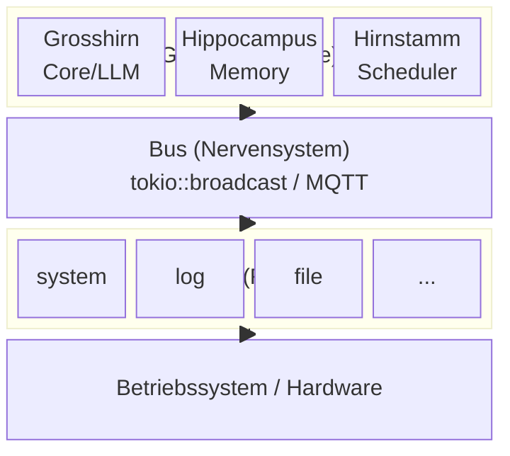
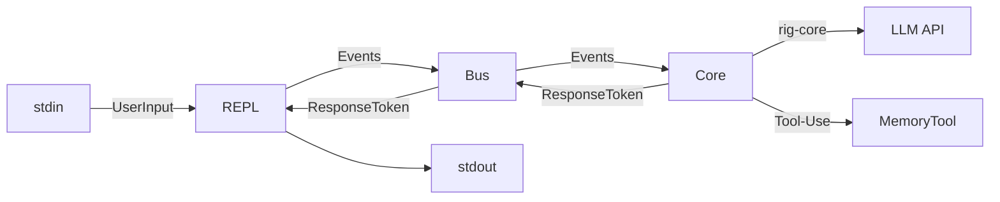
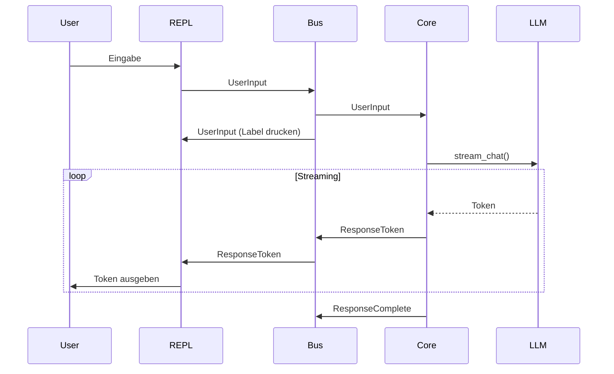
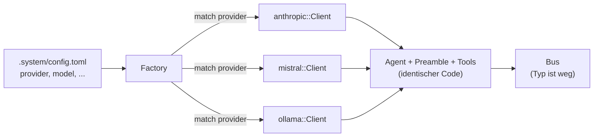
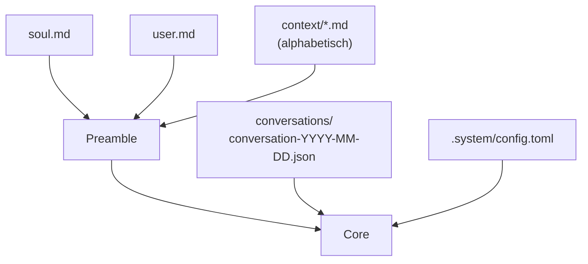

# AIUX - Architektur

> Was AIUX ist, wie es gebaut ist, welche Entscheidungen dahinter stehen.

---

## Leitprinzip: Koerper-Architektur

AIUX ist nach dem Vorbild eines Koerpers gebaut. Nicht als 1:1 Kopie des
Menschen, sondern als Inspiration fuer ein System dessen Gehirn ein Sprachmodell ist.



**Grosshirn** = Core. Das LLM denkt, spricht, entscheidet.
Alles muss als Sprache ankommen.

**Hippocampus** = automatische Gedaechtnisbildung. Hoert auf dem Bus mit,
speichert wichtige Dinge ohne bewusste Entscheidung. (geplant, Phase C)

**Hirnstamm** = Scheduler. Rhythmen ohne bewusstes Denken:
Puls, Atem, Tagesrueckblick. (geplant, Phase H)

### Nerves, Tools, Chat

- **Nerves** (Fuehler) = passive Sensoren. Jeder Nerve hat eigenen Filter
  (verteilter Thalamus), uebersetzt in Text. (geplant, Phase D+G)
- **Tools** (Haende) = aktive Handlungen. Das Grosshirn entscheidet bewusst
  etwas zu tun (MemoryTool, spaeter ShellTool, MessageTool).
- **Chat** ist kein Nerve. Direkter Zugang zum Grosshirn, kein Filter.
  REPL, spaeter Telegram/Web als Gateways. (Gateway geplant, Phase F)

---

## Aktueller Stand



Gebaut und lauffaehig: REPL, Core mit Streaming, MemoryTool, Preamble-Assembly,
Conversation-Persistenz, Kompaktifizierung. Kein Daemon, keine Nerves, zwei Agents.

---

## Agents

Zwei eigenstaendige rig-Agents, NICHT verschachtelt (kein Sub-Agent per `.tool()`).

| Agent | Datei | Preamble | Tools | History | Ausloeser |
|-------|-------|----------|-------|---------|-----------|
| **Cortex** (Grosshirn) | `agent/cortex.rs` | soul + user + context | soul, user, memory | ja, mit Streaming | User-Input via Bus |
| **Hippocampus** | `agent/hippocampus.rs` | compact-preamble.md | soul, user, memory | nein (leere `vec![]`) | Rust-Code (Schwellwert, /clear, /quit) |

Der Cortex ist der einzige Agent der auf dem Bus lauscht. Der Hippocampus wird
vom Cortex per Rust-Aufruf gestartet - das LLM entscheidet NICHT selbst
wann der Hippocampus laeuft, das steuert der Code.

Aufgaben des Hippocampus:
- **Kompaktifizierung** (`compact_history`): Token-Schwellwert erreicht → Wissen destillieren, History kuerzen
- **Memory-Flush** (`memory_flush`): Bei /clear und /quit → Wissen sichern ohne History zu kuerzen

---

## Event-Bus

Intern `tokio::sync::broadcast`, spaeter extern MQTT fuer Nerves.

| Event | Richtung | Bedeutung |
|-------|----------|-----------|
| `UserInput` | REPL → Core | User hat etwas eingegeben |
| `ResponseToken` | Core → REPL | Ein Token (Streaming) |
| `ResponseComplete` | Core → REPL | Antwort fertig |
| `SystemMessage` | Core → REPL | System-Info (Usage, Fehler) |
| `Compacting` / `Compacted` | Core → REPL | Kompaktifizierung laeuft/fertig |
| `ClearHistory` | REPL → Core | History loeschen (/clear) |
| `Shutdown` | REPL → alle | Herunterfahren (/quit) |



Regeln:
- Jedes Modul hoert nur auf relevante Events, Rest ignorieren.
- Publisher wissen nicht wer zuhoert (lose Kopplung).
- Kein Request-Response. Events sind fire-and-forget.

---

## Agent-Factory

rig-core Provider erzeugen verschiedene Rust-Typen. Die Factory kapselt das:



Ab `client.agent(model)` ist der Code bei allen Providern identisch.
Der Agent-Typ lebt nur innerhalb seines Tasks, nach aussen gibt es nur Events.

### Config

Flaches Format in `home/.system/config.toml`. API-Keys aus `.env`.

```toml
provider = "anthropic"
model = "claude-sonnet-4-5-20250929"
temperature = 0.7
# api_key_env = "ANTHROPIC_API_KEY"  # Default pro Provider
# context_window = 200000            # Override fuer Ollama etc.
# compact_threshold = 80             # Kompaktifizierung bei X%
```

---

## Boot-Sequence



Spaetere Erweiterungen: skills/*.md, environment.md.

---

## Memory-Modell

| Typ | Format | Lebensdauer |
|-----|--------|-------------|
| **Kurzzeit** | context/*.md | Permanent, vom Agent verwaltet (MemoryTool) |
| **Konversation** | conversations/conversation-YYYY-MM-DD.json | Pro Tag |
| **Langzeit** | SQLite + RAG (geplant) | Permanent, durchsuchbar |

**Kompaktifizierung:** Bei hoher Token-Nutzung (`compact_threshold`) wird die
History automatisch zusammengefasst. `[KOMPAKTIFIZIERUNG]`-Marker in der History,
Agent sieht nur ab dem letzten Marker.

---

## Rollen (Zielbild, Phase E)

Parallele Agent-Instanzen mit eigener Config, eigenem Memory, eigenen Nerves.
`main` ist der Boss, andere Rollen werden von `main` gesteuert.

Was immer gleich bleibt: **soul.md** (Identitaet) und **user.md** (Mensch).
Preamble pro Rolle: `soul + user + role + role-memory + role-context`.

---

## Verzeichnisstruktur

### Repo

```
aiux/
├── core/src/
│   ├── main.rs              # Verdrahtung
│   ├── config.rs            # Config laden
│   ├── history.rs           # Conversation-Persistenz, Kompaktifizierungs-Schwellwert
│   ├── home.rs              # home/-Verzeichnis finden
│   ├── preamble.rs          # System-Prompt Assembly (fuer alle Agents)
│   ├── repl.rs              # Kommandozeile
│   ├── agent/
│   │   ├── mod.rs           # Modul-Einstiegspunkt (re-exports)
│   │   ├── cortex.rs        # Cortex-Agent (Grosshirn)
│   │   └── hippocampus.rs   # Hippocampus-Agent (Gedaechtnis)
│   ├── bus/
│   │   ├── mod.rs           # Event-Bus (broadcast)
│   │   └── events.rs        # Event-Typen
│   └── tools/
│       ├── mod.rs           # Tool-Registry
│       ├── soul.rs          # SoulTool
│       ├── user.rs          # UserTool
│       └── memory.rs        # MemoryTool
├── nerve/                   # Platzhalter
├── home/
│   ├── .system/
│   │   ├── config.toml
│   │   └── compact-preamble.md
│   ├── memory/
│   │   ├── soul.md
│   │   ├── user.md
│   │   ├── context/
│   │   └── conversations/  # .gitignore
│   ├── skills/              # Platzhalter
│   └── tools/               # Platzhalter
└── docs/
```

### Zielsystem

```
/home/claude/
├── .system/config.toml
├── memory/{soul.md, user.md, context/, conversations/}
├── skills/
└── tools/
```

---

## Tech-Stack

### Eingebaut

| Crate | Zweck |
|-------|-------|
| **rig-core** | LLM Framework (Multi-Provider, Streaming, Tool-Use) |
| **tokio** | Async Runtime |
| **serde** + **serde_json** | Serialisierung |
| **schemars** | JSON Schema (Tool-Definitionen) |
| **chrono** | Datum (History-Rotation) |
| **thiserror** | Error-Typen |
| **anyhow** | Error-Handling |
| **futures** | Stream-Verarbeitung |
| **dotenvy** | .env laden |
| **toml** | Config parsen |

### Geplant

| Crate | Zweck | Phase |
|-------|-------|-------|
| **rig-sqlite** | Vector Store + RAG | Fernziel |
| **rumqttc** | MQTT Client (externer Bus) | D |
| **tokio-cron-scheduler** | Scheduler-Rhythmen | H |
| **tract-onnx** | Lokale Inference | Fernziel |

---

## Design Patterns

| Metapher | Komponente | Pattern |
|----------|-----------|---------|
| Grosshirn | Core/LLM | - |
| Hippocampus | Memory (Hintergrund) | Observer |
| Hirnstamm | Scheduler | Scheduled Jobs |
| Fuehler | Nerves | Observer + Strategy |
| Nervensystem | Bus | Pub/Sub + Mediator |
| Haende | Tools | Command |
| Seele | soul.md | Config as Identity |
| Gespraech | Chat/Gateway | - |

Eingebaute Patterns:
- **Factory** - Agent-Erstellung anhand Config (Provider-Typ bleibt intern)
- **Repository** - MemoryTool abstrahiert Speicherzugriff
- **Composite** - Preamble aus Teilen zusammengebaut (soul + user + context)
- **Command** - Tool-Calls als serialisierte Command-Objekte

---

## Plattformen

Primaer Raspberry Pi 4 (aarch64), laeuft auf jedem Linux, macOS, Windows.
Alle Dependencies sind Pure Rust.

```bash
# Raspi (Cross-Compilation)
cargo build --release --target aarch64-unknown-linux-musl

# Lokal
cargo build --release
```

---

*Letzte Aktualisierung: 2026-03-02*
