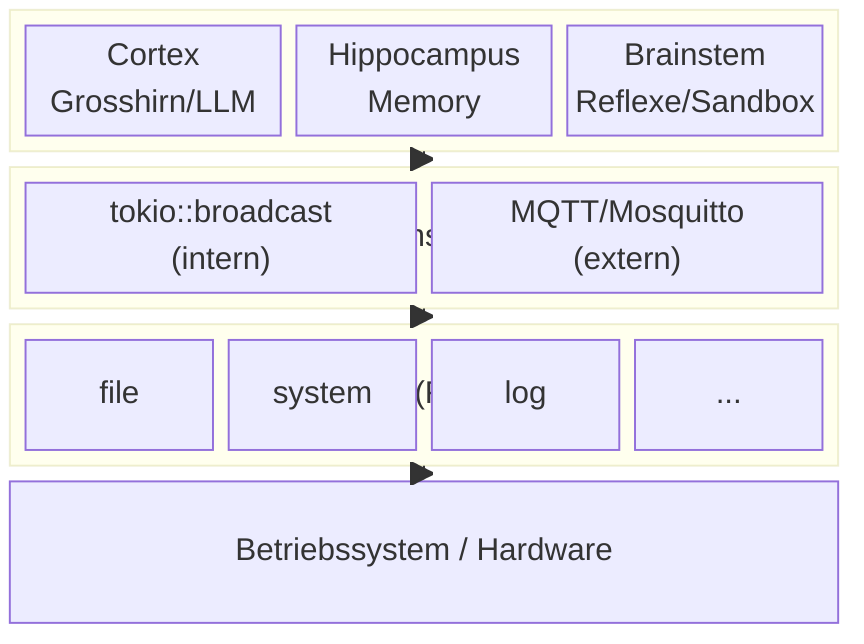
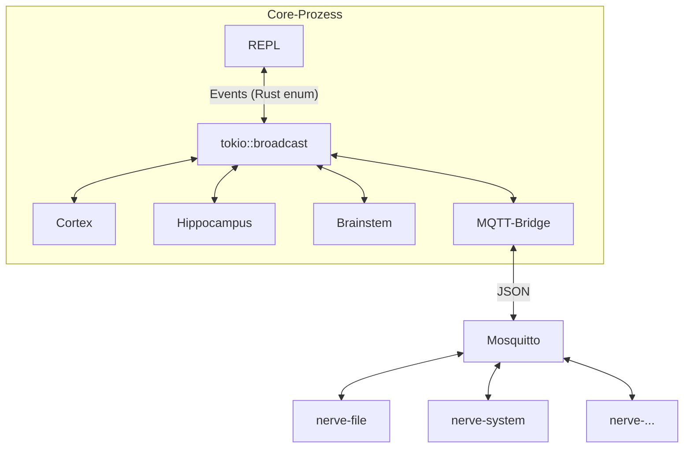
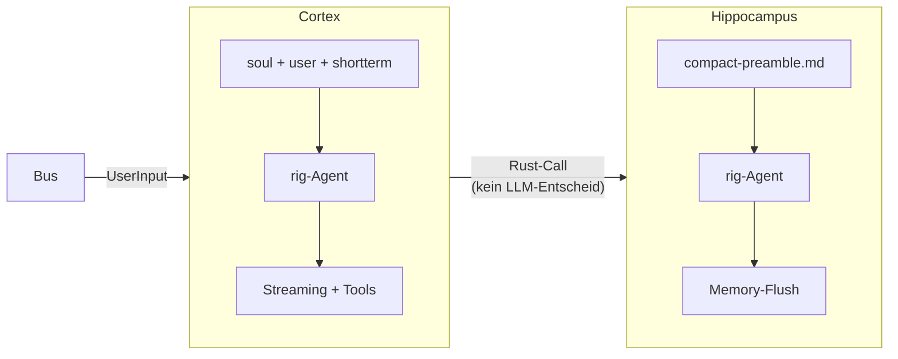
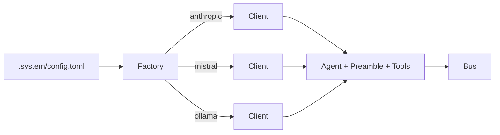
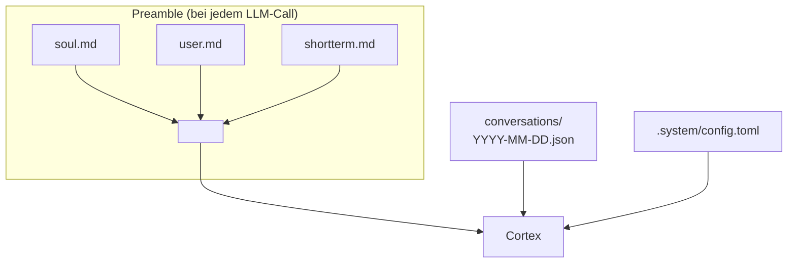
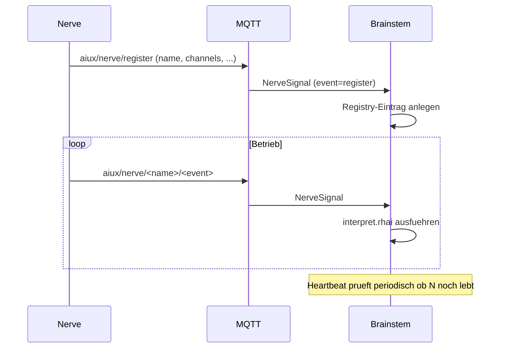
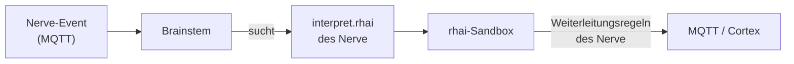

# AIUX - Architektur

> Koerper-Architektur: Ein System dessen Gehirn ein Sprachmodell ist.

---

## Ueberblick



| Komponente | Biologisch | Aufgabe |
|------------|-----------|---------|
| **Cortex** | Grosshirn | LLM. Denkt, spricht, entscheidet. |
| **Hippocampus** | Gedaechtnis | Destilliert Wissen in Memory-Dateien. Vom Code gesteuert, nicht vom LLM. |
| **Brainstem** | Hirnstamm | Sandbox fuer Nerve-Verarbeitung + Heartbeat. Keine eigene Logik. |
| **Nerves** | Sinnesorgane | Eigene Prozesse, passive Sensoren, kommunizieren ueber MQTT. |
| **Tools** | Haende | Aktive Handlungen. Cortex entscheidet bewusst. |
| **Chat** | Gespraech | Direkter Zugang zum Cortex (REPL, spaeter Gateway). Kein Nerve. |

---

## Kommunikation

Zwei Bus-Systeme, verbunden durch die Bridge:



**Interner Bus** (`tokio::broadcast`): In-process, typsicher, zero-copy. Fuer REPL ↔ Core.
Ohne externe Dependencies — AIUX laeuft auch ohne MQTT als reiner Chat.

**Externer Bus** (MQTT/Mosquitto): Prozessuebergreifend, sprachunabhaengig. Fuer Nerves.
Bridge uebersetzt selektiv — der Cortex weiss nicht dass MQTT existiert.

### Events

| Event | Richtung | MQTT |
|-------|----------|------|
| `UserInput` | REPL → Core | nein |
| `ResponseToken` | Core → REPL | nein |
| `ResponseComplete` | Core → REPL | → `aiux/cortex/response` |
| `SystemMessage` | Core → REPL | → `aiux/cortex/system` |
| `ToolCall` | Core → REPL | → `aiux/cortex/toolcall` |
| `NerveSignal` | Bridge → Core | ← `aiux/nerve/#` |
| `Compacting` / `Compacted` | Core → REPL | nein |
| `ClearHistory` | REPL → Core | nein |
| `Shutdown` | REPL → alle | nein |

### MQTT Topics

```
aiux/
├── nerve/                  # Nerves → Bridge (incoming)
│   ├── register            # Nerve meldet sich an
│   └── <name>/<event>      # Nerve-spezifische Events
├── cortex/                 # Bridge → aussen (outgoing)
│   ├── response            # LLM-Antworten
│   ├── system              # System-Nachrichten
│   └── toolcall            # Tool-Aufrufe
└── brainstem/              # Verarbeitete Ergebnisse (D.2)
    └── <name>/
```

### MQTT Message-Schema

Jede Nachricht auf `aiux/nerve/<name>/<event>` **muss** dieses Format haben:

```json
{
  "ts": "2026-03-02T14:30:00Z",
  "source": "nerve/file",
  "event": "changed",
  "data": { }
}
```

| Feld | Typ | Pflicht | Beschreibung |
|------|-----|---------|-------------|
| `ts` | String (ISO 8601) | ja | Zeitstempel des Events |
| `source` | String | ja | Absender, z.B. `"nerve/file"` |
| `event` | String | ja | Was passiert ist, z.B. `"changed"` |
| `data` | Object | nein | Nerve-spezifische Daten (frei) |

Die Bridge validiert Pflichtfelder — fehlende Felder oder kein JSON → Warnung, Message verworfen.

---

## Agents



| Agent | Tools | History | Ausloeser |
|-------|-------|---------|-----------|
| **Cortex** | soul, user, memory | ja, Streaming | UserInput via Bus |
| **Hippocampus** | soul, user, memory | nein | Schwellwert, /clear, /quit |

### Agent-Factory

Provider-Typ wird intern aufgeloest — nach aussen nur Events:



---

## Memory



| Typ | Format | Lebensdauer |
|-----|--------|-------------|
| **Kurzzeit** | shortterm.md | Permanent, Agent verwaltet (MemoryTool) |
| **Konversation** | conversation-YYYY-MM-DD.json | Pro Tag |
| **Langzeit** | SQLite + RAG (geplant) | Permanent, durchsuchbar |

Kompaktifizierung bei `compact_threshold`: History zusammenfassen,
Wissen destillieren, `[KOMPAKTIFIZIERUNG]`-Marker setzen.

---

## Nerve-System

Ein Nerve = eigenstaendiger Prozess der sich beim Start selbst registriert.

### Self-Registration

Jeder Nerve schickt beim Start eine Register-Message auf `aiux/nerve/register`:

```json
{
    "ts": "2026-03-03T14:00:00Z",
    "source": "nerve/system",
    "event": "register",
    "data": {
        "name": "system-monitor",
        "version": "0.1.0",
        "description": "Ueberwacht CPU, RAM, Disk, Temperatur",
        "channels": [
            "aiux/nerve/system/stats",
            "aiux/nerve/system/alert"
        ],
        "home": "nerves/system-monitor"
    }
}
```

| Feld | Pflicht | Beschreibung |
|------|---------|-------------|
| `name` | ja | Eindeutiger Name des Nerve |
| `version` | ja | Versionsnummer |
| `description` | ja | Was der Nerve tut (Text fuer den Cortex) |
| `channels` | ja | MQTT-Topics die dieser Nerve publishen wird |
| `home` | nein | Pfad zum Nerve-Verzeichnis (relativ zu aiux home, fuer interpret.rhai) |

Der Brainstem empfaengt die Registrierung und traegt den Nerve in die Registry ein.
Danach verarbeitet er Events dieses Nerve wie gewohnt (interpret.rhai, Weiterleitung).

Der Brainstem startet Nerves automatisch: Er scannt `home/nerves/*/manifest.toml`
beim Boot, findet das `binary`-Feld und startet den Prozess. Der Nerve registriert
sich dann selbst per MQTT. Bei Shutdown beendet der Brainstem alle Child-Prozesse.

### Nerve-Verzeichnis

```
nerves/system-monitor/
├── manifest.toml       # Pflicht: binary = "nerve-system"
└── interpret.rhai      # Verarbeitungslogik fuer den Brainstem (optional)
```

`manifest.toml` ist minimal — nur das `binary`-Feld zum Starten.
Alles andere (Name, Channels, Description) kommt per Self-Registration.

### Lebenszyklus



---

## Brainstem

Sandbox im Core-Prozess. Keine eigene Logik — fuehrt aus was Nerves mitliefern.



| Aufgabe | Beschreibung |
|---------|-------------|
| Nerve-Start | `home/nerves/*/manifest.toml` scannen, Binaries starten |
| Registration | `aiux/nerve/register` empfangen, Registry-Eintrag anlegen |
| Verarbeitung | interpret.rhai aus Nerve-Verzeichnis ausfuehren |
| Registry | Welche Nerves aktiv, welche Channels |
| Heartbeat | Watchdog, Rhythmen (Puls/Atem), Reminder |
| Shutdown | Alle Child-Prozesse sauber beenden |

---

## Verzeichnisstruktur

```
aiux/
├── core/src/
│   ├── main.rs              # Verdrahtung
│   ├── config.rs            # Config aus .system/config.toml
│   ├── history.rs           # Conversation-Persistenz
│   ├── home.rs              # home/-Verzeichnis finden
│   ├── repl.rs              # Kommandozeile
│   ├── mqtt.rs              # MQTT-Bridge
│   ├── agent/{cortex,hippocampus}.rs
│   ├── bus/{mod,events}.rs
│   └── tools/{soul,user,memory}.rs
├── nerve/                   # Nerve-Binaries
│   ├── shared/              # Gemeinsamer Code (MQTT, Registration)
│   └── system/              # nerve-system Binary
├── home/
│   ├── .system/             # Config + System-Prompts
│   ├── memory/              # soul.md, user.md, shortterm.md, conversations/
│   ├── nerves/              # Nerve-Verzeichnisse
│   ├── skills/              # Platzhalter
│   └── tools/               # Platzhalter
└── docs/
```

Zielsystem (Raspi): `/home/claude/` mit gleicher Struktur.

---

## Tech-Stack

| Crate | Zweck |
|-------|-------|
| **rig-core** | LLM (Multi-Provider, Streaming, Tool-Use) |
| **tokio** | Async Runtime |
| **rumqttc** | MQTT Client |
| **serde** / **serde_json** | Serialisierung |
| **schemars** | JSON Schema (Tool-Definitionen) |
| **chrono** | Datum (History-Rotation) |
| **thiserror** / **anyhow** | Error-Handling |
| **futures** | Stream-Verarbeitung |
| **dotenvy** | .env laden |
| **toml** | Config parsen |
| **rhai** | Brainstem-Sandbox (interpret.rhai) |
| **cron** | Cron-Ausdruecke (Scheduler/Heartbeat) |
| **notify** | Filesystem-Watcher (nerve-file) |

Geplant:
**rig-sqlite** (RAG), **tract-onnx** (lokale Inference).

---

## Offene Fragen

- Brainstem-LLM: Welches kleine Modell, wie angebunden?
- Dynamische Tools: Nerves liefern dem Cortex Tools (rig-core `ToolDyn`)?
- Heartbeat-Details: Intervalle, Watchdog-Timeouts

---

*Letzte Aktualisierung: 2026-03-02*
