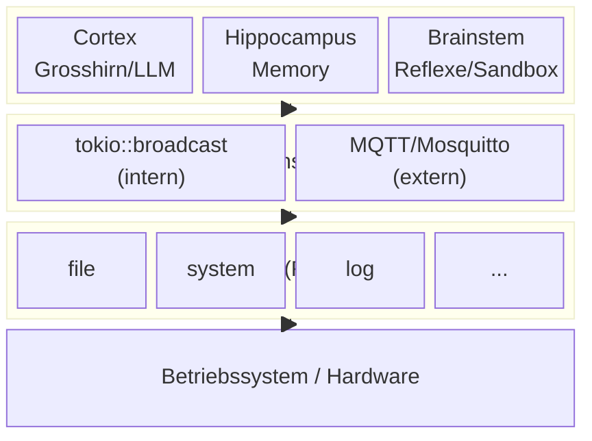
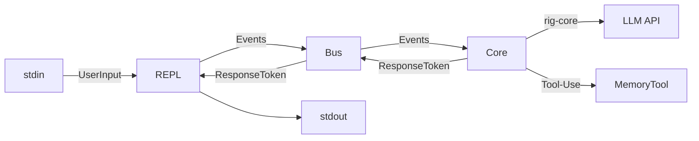
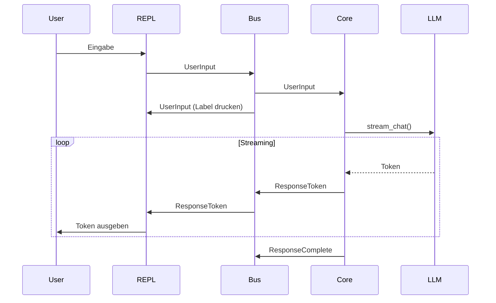
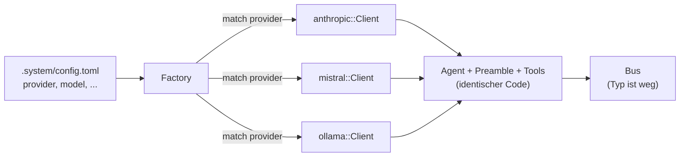
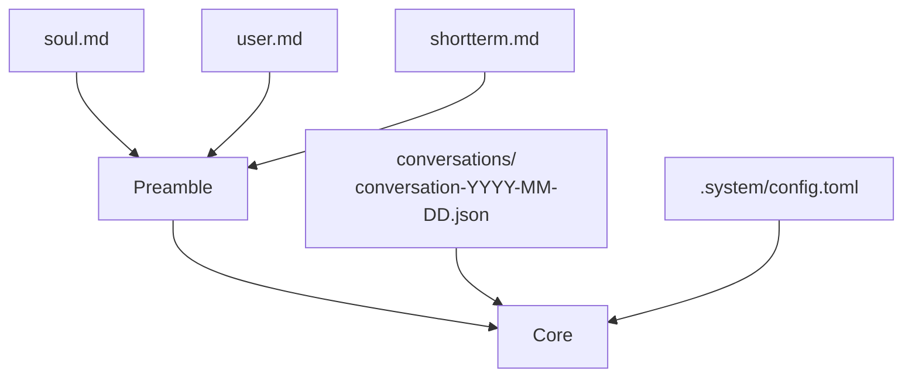

# AIUX - Architektur

> Was AIUX ist, wie es gebaut ist, welche Entscheidungen dahinter stehen.

---

## Leitprinzip: Koerper-Architektur

AIUX ist nach dem Vorbild eines Koerpers gebaut. Nicht als 1:1 Kopie des
Menschen, sondern als Inspiration fuer ein System dessen Gehirn ein Sprachmodell ist.



**Cortex** (Grosshirn) = das LLM. Denkt, spricht, entscheidet.
Einziger Ort fuer komplexe Entscheidungen. Alles kommt als Sprache an.

**Hippocampus** = automatische Gedaechtnisbildung. Wird vom Cortex per
Rust-Code aufgerufen, destilliert Wissen in Memory-Dateien.

**Brainstem** (Truncus cerebri) = Reflexe, autonome Verarbeitung und Heartbeat.
Kein eigenes Denken - fuehrt aus was Nerves mitliefern. Sandbox fuer
Scripte und Modelle. Haelt das System am Leben (Watchdog, Rhythmen, Reminder).
Siehe [Brainstem](#brainstem).

### Cortex, Nerves, Tools, Chat

- **Nerves** = passive Sensoren. Eigene Prozesse, kommunizieren ueber MQTT.
  Jeder Nerve liefert seine eigene Verarbeitungslogik fuer den Brainstem mit.
  Siehe [Nerve-System](#nerve-system).
- **Tools** (Haende) = aktive Handlungen. Der Cortex entscheidet bewusst
  etwas zu tun. Nerves koennen eigene Tools mitliefern (dynamisch via `ToolDyn`).
- **Chat** ist kein Nerve. Direkter Zugang zum Cortex, kein Filter.
  REPL intern, spaeter Telegram/Web als Gateways.

---

## Aktueller Stand



Gebaut und lauffaehig: REPL, Core mit Streaming, MemoryTool,
Conversation-Persistenz, Kompaktifizierung, MQTT-Bridge (optional).
Kein Daemon, keine Nerves, zwei Agents.

---

## Agents

Zwei eigenstaendige rig-Agents, NICHT verschachtelt (kein Sub-Agent per `.tool()`).

| Agent | Datei | Preamble | Tools | History | Ausloeser |
|-------|-------|----------|-------|---------|-----------|
| **Cortex** (Grosshirn) | `agent/cortex.rs` | soul + user + shortterm | soul, user, memory | ja, mit Streaming | User-Input via Bus |
| **Hippocampus** | `agent/hippocampus.rs` | compact-preamble.md | soul, user, memory | nein (leere `vec![]`) | Rust-Code (Schwellwert, /clear, /quit) |

Der Cortex ist der einzige Agent der auf dem Bus lauscht. Der Hippocampus wird
vom Cortex per Rust-Aufruf gestartet - das LLM entscheidet NICHT selbst
wann der Hippocampus laeuft, das steuert der Code.

Aufgaben des Hippocampus:
- **Kompaktifizierung** (`compact_history`): Token-Schwellwert erreicht → Wissen destillieren, History kuerzen
- **Memory-Flush** (`memory_flush`): Bei /clear und /quit → Wissen sichern ohne History zu kuerzen

---

## Event-Bus

Intern `tokio::sync::broadcast`, spaeter extern MQTT fuer Nerves.

| Event | Richtung | Bedeutung |
|-------|----------|-----------|
| `UserInput` | REPL → Core | User hat etwas eingegeben |
| `ResponseToken` | Core → REPL | Ein Token (Streaming) |
| `ResponseComplete` | Core → REPL | Antwort fertig |
| `SystemMessage` | Core → REPL | System-Info (Usage, Fehler) |
| `Compacting` / `Compacted` | Core → REPL | Kompaktifizierung laeuft/fertig |
| `ClearHistory` | REPL → Core | History loeschen (/clear) |
| `ToolCall` | Core → REPL | Tool aufgerufen |
| `NerveSignal` | Bridge → Core | Externes Signal von einem Nerve (via MQTT) |
| `Shutdown` | REPL → alle | Herunterfahren (/quit) |



Regeln:
- Jedes Modul hoert nur auf relevante Events, Rest ignorieren.
- Publisher wissen nicht wer zuhoert (lose Kopplung).
- Kein Request-Response. Events sind fire-and-forget.

---

## Agent-Factory

rig-core Provider erzeugen verschiedene Rust-Typen. Die Factory kapselt das:



Ab `client.agent(model)` ist der Code bei allen Providern identisch.
Der Agent-Typ lebt nur innerhalb seines Tasks, nach aussen gibt es nur Events.

### Config

Flaches Format in `home/.system/config.toml`. API-Keys aus `.env`.

```toml
provider = "anthropic"
model = "claude-sonnet-4-5-20250929"
temperature = 0.7
# api_key_env = "ANTHROPIC_API_KEY"  # Default pro Provider
# context_window = 200000            # Override fuer Ollama etc.
# compact_threshold = 80             # Kompaktifizierung bei X%
```

---

## Boot-Sequence



Spaetere Erweiterungen: skills/*.md, environment.md.

---

## Memory-Modell

| Typ | Format | Lebensdauer |
|-----|--------|-------------|
| **Kurzzeit** | shortterm.md | Permanent, vom Agent verwaltet (MemoryTool) |
| **Konversation** | conversations/conversation-YYYY-MM-DD.json | Pro Tag |
| **Langzeit** | SQLite + RAG (geplant) | Permanent, durchsuchbar |

**Kompaktifizierung:** Bei hoher Token-Nutzung (`compact_threshold`) wird die
History automatisch zusammengefasst. `[KOMPAKTIFIZIERUNG]`-Marker in der History,
Agent sieht nur ab dem letzten Marker.

---

## Rollen (Zielbild, Phase E)

Parallele Agent-Instanzen mit eigener Config, eigenem Memory, eigenen Nerves.
`main` ist der Boss, andere Rollen werden von `main` gesteuert.

Was immer gleich bleibt: **soul.md** (Identitaet) und **user.md** (Mensch).
Preamble pro Rolle: `soul + user + role + role-memory + role-context`.

---

## Verzeichnisstruktur

### Repo

```
aiux/
├── core/src/
│   ├── main.rs              # Verdrahtung
│   ├── config.rs            # Config laden
│   ├── history.rs           # Conversation-Persistenz, Kompaktifizierungs-Schwellwert
│   ├── home.rs              # home/-Verzeichnis finden
│   ├── repl.rs              # Kommandozeile
│   ├── agent/
│   │   ├── mod.rs           # Modul-Einstiegspunkt (re-exports)
│   │   ├── cortex.rs        # Cortex-Agent (Grosshirn)
│   │   └── hippocampus.rs   # Hippocampus-Agent (Gedaechtnis)
│   ├── bus/
│   │   ├── mod.rs           # Event-Bus (broadcast)
│   │   └── events.rs        # Event-Typen
│   ├── mqtt.rs              # MQTT-Bridge (intern ↔ extern)
│   └── tools/
│       ├── mod.rs           # Tool-Registry
│       ├── soul.rs          # SoulTool
│       ├── user.rs          # UserTool
│       └── memory.rs        # MemoryTool
├── nerve/                   # Nerve-Binaries (Workspace-Crate)
├── home/
│   ├── .system/
│   │   ├── config.toml
│   │   └── compact-preamble.md
│   ├── memory/
│   │   ├── soul.md
│   │   ├── user.md
│   │   ├── shortterm.md
│   │   └── conversations/  # .gitignore
│   ├── nerves/              # Nerve-Verzeichnisse (Plugins)
│   │   ├── file-watcher/    #   manifest + channels + interpret + binary
│   │   └── system-monitor/  #   manifest + channels + interpret + binary
│   ├── skills/              # Platzhalter
│   └── tools/               # Platzhalter
└── docs/
```

### Zielsystem

```
/home/claude/
├── .system/config.toml
├── memory/{soul.md, user.md, shortterm.md, conversations/}
├── nerves/{file-watcher/, system-monitor/, ...}
├── skills/
└── tools/
```

---

## Nerve-System

> Nerves geben dem Agent Sinne. Ohne Nerves ist er ein Kopf im Glas.

### Was ist ein Nerve

Ein Nerve ist ein **eigenstaendiger Prozess** der die Umwelt beobachtet und
Aenderungen ueber MQTT meldet. Er ist passiv (nimmt wahr, handelt nicht)
und spezialisiert (eine Domaene pro Nerve).

Ein Nerve kann alles sein: eine Rust-Binary, ein Python-Script, ein
Shell-Script, ein fertiges Tool wie Telegraf. Das Einzige was zaehlt:
er spricht MQTT und haelt sich ans Nerve-Protokoll.

### Nerve-Protokoll

Jeder Nerve muss zwei Dinge tun:

1. **Registrieren** - sich beim Start auf `aiux/nerve/register` anmelden
2. **Publizieren** - Events auf seinen Channels veroeffentlichen

```
# Registrierung
Topic:   aiux/nerve/register
Payload: { "name": "file-watcher", "channels": ["aiux/nerve/file/changed"] }

# Events
Topic:   aiux/nerve/file/changed
Payload: { "path": "memory/soul.md", "change_type": "modify", "ts": "..." }
```

### MQTT Topic-Struktur

```
aiux/
├── nerve/
│   ├── register                 ← Nerve meldet sich an
│   └── <name>/
│       └── <event>              ← Nerve-spezifische Events
└── brainstem/
    └── <name>/                  ← Verarbeitete Ergebnisse
```

Alles laeuft ueber MQTT. Der Cortex kann als Superuser auf beliebige
Topics subscriben und mitlesen wenn er will (`aiux/#` = alles).

### Nerve als Verzeichnis

Ein Nerve ist ein Verzeichnis unter `nerves/` das alles mitbringt
was es braucht - den Sensor UND seine Verarbeitungslogik fuer den Brainstem:

```
nerves/
├── file-watcher/
│   ├── manifest.toml        # MUSS: Wer bin ich, was starten
│   ├── channels.toml        # MUSS: Welche MQTT-Topics
│   ├── interpret.*           # Verarbeitung fuer den Brainstem
│   └── nerve-file           # Der Sensor (Binary/Script)
│
└── system-monitor/
    ├── manifest.toml
    ├── channels.toml
    ├── interpret.*           # Verarbeitung fuer den Brainstem
    ├── config.toml           # Nerve-eigene Config (optional)
    └── nerve-system
```

**manifest.toml** (Pflicht):
```toml
name = "file-watcher"
version = "0.1.0"
description = "Beobachtet Dateiänderungen in home/"
binary = "nerve-file"
```

**channels.toml** (Pflicht):
```toml
[[publish]]
topic = "aiux/nerve/file/changed"
description = "Datei wurde erstellt, geaendert oder geloescht"

[publish.schema]
path = "string"
change_type = "string"
```

**interpret.\*** - Die Verarbeitungslogik die der Nerve fuer den Brainstem
mitliefert. Das Format bestimmt der Nerve:
- `.rhai` - Script (rhai, sandboxed)
- `.md` - Skill fuer das Brainstem-LLM
- Eigenes Modell oder eigene API - Details spaeter

Der Nerve bestimmt auch die **Weiterleitungsregeln**: wohin die
verarbeiteten Ergebnisse gehen (welche MQTT-Topics, ob der Cortex
informiert werden soll, etc.).

---

## Brainstem

> Sandbox, nicht Denker. Fuehrt aus was Nerves mitliefern.

### Was der Brainstem ist

Der Brainstem ist eine **Sandbox** im Core-Prozess. Er hat keine eigene Logik -
er fuehrt aus was Nerves in ihren `interpret.*` Dateien mitliefern.

Wie der biologische Hirnstamm: die Grundreflexe sind verdrahtet,
das Grosshirn muss nicht "atme jetzt" denken.

### Sandbox-Prinzip

```
Nerve-Event kommt ueber MQTT
         │
         ▼
    Brainstem sucht interpret.* des Nerve
         │
         ▼
    Fuehrt die mitgelieferte Logik aus
         │
         ▼
    Ergebnis gemaess Weiterleitungsregeln des Nerve
    (MQTT-Topics, Cortex informieren, etc.)
```

Der Nerve bestimmt WAS beobachtet wird, WIE es verarbeitet wird,
und WOHIN die Ergebnisse gehen.
Der Brainstem stellt die Laufzeitumgebungen bereit:
- **rhai-Engine** - Script-Interpreter (sandboxed)
- **Eigenes LLM** - kleines Modell im Brainstem, auf das Nerves zugreifen koennen
- **Externe Modelle/APIs** - ein Nerve kann auch eigene mitbringen (spaeter)

### Brainstem-Aufgaben

| Aufgabe | Wie |
|---------|-----|
| Nerve-Events verarbeiten | interpret.* aus dem Nerve-Verzeichnis ausfuehren |
| Registry fuehren | Welche Nerves sind aktiv, was senden sie |
| Nerve-Discovery | Neues Nerve-Verzeichnis → scannen, laden, starten |
| Ergebnisse weiterleiten | Gemaess Weiterleitungsregeln des Nerve |
| Heartbeat (Watchdog) | Pruefen ob Nerves noch leben |
| Heartbeat (Rhythmen) | Cortex regelmaessig triggern (Puls, Atem, Tagesrueckblick) |
| Heartbeat (Reminder) | Cortex kann Timer setzen ("erinnere mich in 1h") |

### Was der Brainstem NICHT ist

- **Keine eigene Logik** - er fuehrt nur aus was Nerves mitbringen
- **Kein Entscheider** - er meldet, der Cortex entscheidet
- **Kein eigener Prozess** - laeuft im Core-Prozess

### Nerve-Discovery und Bootstrap

Beim Start scannt der Brainstem einmalig `nerves/*/manifest.toml` und
startet alle gefundenen Nerves. Danach uebernimmt der file-watcher Nerve:

```
Boot:
  Brainstem scannt nerves/          ← einmalig, hardcoded
  Startet file-watcher + andere

Runtime:
  Jemand legt nerves/garden/ ab
  file-watcher bemerkt es           ← MQTT Event
  Brainstem fuehrt Regel aus        ← interpret: nerve_discover
  Brainstem scannt nerves/garden/   ← gleiche Logik wie beim Boot
  Startet nerve-garden
  Informiert Cortex                 ← "Neuer Nerve: garden"
```

Der file-watcher IST das Discovery-System. Kein separater Mechanismus noetig.

---

## Kommunikationsarchitektur

### Zwei Bus-Systeme

```
┌────────────────────────────────────────────────────┐
│                    Core-Prozess                     │
│                                                     │
│  ┌──────┐  tokio::broadcast  ┌─────────────────┐  │
│  │ REPL │◄──────────────────►│     Cortex      │  │
│  └──────┘    (in-process)    │  (LLM, Tools)   │  │
│                               └────────┬────────┘  │
│                                        │            │
│                               ┌────────┴────────┐  │
│                               │    Brainstem    │  │
│                               │ (Sandbox/Reflexe│  │
│                               │  Registry)      │  │
│                               └────────┬────────┘  │
│                                        │            │
│                               ┌────────┴────────┐  │
│                               │  MQTT Bridge    │  │
│                               └────────┬────────┘  │
└────────────────────────────────────────┼───────────┘
                                         │ MQTT
                                    ┌────┴────┐
                                    │Mosquitto│
                                    └────┬────┘
                          ┌──────────────┼──────────────┐
                          │              │              │
                    nerve-file    nerve-system    nerve-...
```

**Interner Bus** (tokio::broadcast): REPL ↔ Cortex. Schnell, typsicher, in-process.
Fuer alles was im Core-Prozess passiert.

**Externer Bus** (MQTT/Mosquitto): Nerves ↔ Brainstem. Sprachunabhaengig,
prozessuebergreifend. Fuer alles ausserhalb des Core-Prozesses.

**Bridge**: Uebersetzt zwischen beiden Welten. Der Cortex weiss nicht
dass MQTT existiert - er bekommt Events ueber den internen Bus wie immer.

### Datenfluss

```
Nerve (eigener Prozess)
  → MQTT publish auf aiux/nerve/<name>/<event>
    → Bridge empfaengt
      → Brainstem verarbeitet (interpret.*)
        → Ergebnis gemaess Weiterleitungsregeln des Nerve

Cortex (Superuser)
  → Kann jederzeit auf aiux/# subscriben und mitlesen
  → Entscheidet selbst ob und worauf er reagiert
```

---

## Offene Architektur-Fragen

Besprochen aber noch nicht entschieden:

- **Weiterleitungsregeln** - Wie definiert ein Nerve wohin seine Ergebnisse gehen?
- **Brainstem-LLM** - Welches kleine Modell, wie angebunden?
- **Externe Modelle/APIs** - Wie bringt ein Nerve eigene Modelle mit?
- **Dynamische Tools** - Nerves koennten dem Cortex Tools mitliefern
  (rig-core `ToolDyn` + `ToolSet` unterstuetzt das). Format offen.
- **Heartbeat-Details** - Intervalle, Reminder-API, Watchdog-Timeouts

---

## Tech-Stack

### Eingebaut

| Crate | Zweck |
|-------|-------|
| **rig-core** | LLM Framework (Multi-Provider, Streaming, Tool-Use) |
| **tokio** | Async Runtime |
| **serde** + **serde_json** | Serialisierung |
| **schemars** | JSON Schema (Tool-Definitionen) |
| **chrono** | Datum (History-Rotation) |
| **thiserror** | Error-Typen |
| **anyhow** | Error-Handling |
| **futures** | Stream-Verarbeitung |
| **dotenvy** | .env laden |
| **toml** | Config parsen |

| **rumqttc** | MQTT Client (Bridge, Nerves) |

### Geplant

| Crate | Zweck | Phase |
|-------|-------|-------|
| **notify** | Filesystem-Watcher (nerve-file) | D |
| **rhai** | Eingebettete Scriptsprache (Brainstem) | D |
| **rig-sqlite** | Vector Store + RAG | Fernziel |
| **tokio-cron-scheduler** | Scheduler-Rhythmen | Fernziel |
| **tract-onnx** | Lokale Inference | Fernziel |

---

## Design Patterns

| Metapher | Komponente | Pattern |
|----------|-----------|---------|
| Cortex (Grosshirn) | LLM | - |
| Hippocampus | Memory-Destillierung | Observer |
| Brainstem | Reflex-Sandbox | Sandbox + Strategy |
| Nerves (Fuehler) | Sensoren | Plugin + Observer |
| Nervensystem | Bus (intern + MQTT) | Pub/Sub + Bridge |
| Haende | Tools | Command |
| Seele | soul.md | Config as Identity |
| Gespraech | Chat/Gateway | - |

Eingebaute Patterns:
- **Factory** - Agent-Erstellung anhand Config (Provider-Typ bleibt intern)
- **Repository** - MemoryTool abstrahiert Speicherzugriff
- **Composite** - Preamble aus Teilen zusammengebaut (soul + user + shortterm)
- **Command** - Tool-Calls als serialisierte Command-Objekte
- **Plugin** - Nerves als austauschbare Verzeichnisse mit Manifest
- **Bridge** - Uebersetzung zwischen internem Bus und MQTT

---

## Plattformen

Primaer Raspberry Pi 4 (aarch64), laeuft auf jedem Linux, macOS, Windows.
Alle Dependencies sind Pure Rust.

```bash
# Raspi (Cross-Compilation)
cargo build --release --target aarch64-unknown-linux-musl

# Lokal
cargo build --release
```

---

*Letzte Aktualisierung: 2026-03-02 (Nerve-System, Brainstem, MQTT)*
